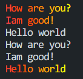
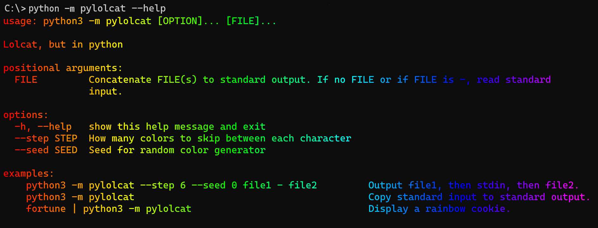

# Lolcat

Python version of the Ruby [lolcat](https://github.com/busyloop/lolcat/) version

## Example python usage

```python
from pylolcat import install, uninstall, Lolcat

# Installs lolcat as default stdout
install()

# These lines will get lolcated
print('Hello world')
print('How are you?')
print('Iam good!')

# Uninstalls lolcat from default stdout
uninstall()

# These lines won't 
print('Hello world')
print('How are you?')
print('Iam good!')

# You can also create a Lolcat instance and call print
lolcat = Lolcat()
lolcat.print('Hello world')
```




## Screenshot
